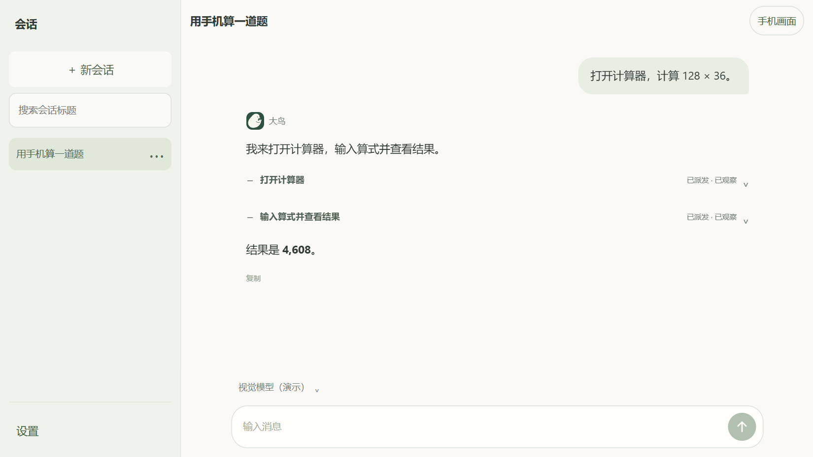
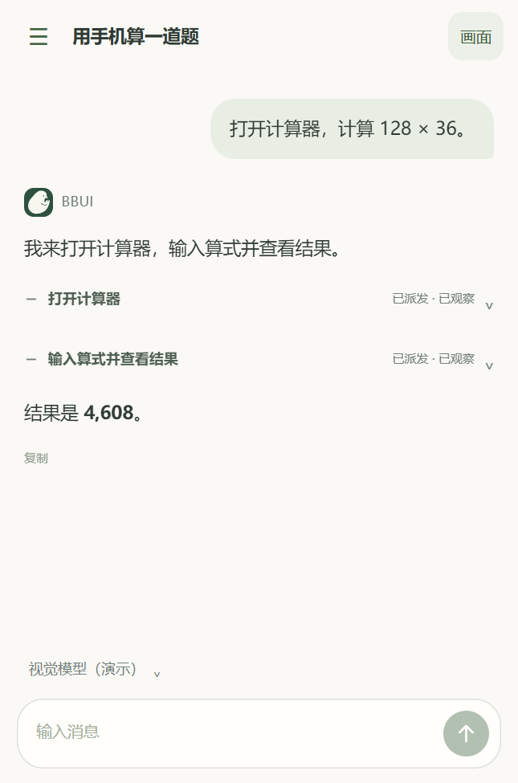

# BigBirdUI · 大鸟手机助手

**一句话，让 AI 帮你操作手机。** 查看页面、查找内容、点击和输入，随时停止或接管。

- **App 不设限**：不设应用白名单，想让 AI 操作哪个 App，就直接告诉它。
- **安卓后台执行**：AI 在独立任务屏中操作，你可以继续使用手机，随时查看进度或接管。

<table>
  <tr><th>电脑端</th><th>Android 端</th></tr>
  <tr>
    <td width="72%"></td>
    <td width="28%"></td>
  </tr>
</table>

## 下载

前往 [Releases](https://github.com/zhang3c3c33c/BigBirdUI/releases) 下载：

| 平台 | 文件 |
| --- | --- |
| Android 11+、arm64 | `BigBirdUI-Android-arm64-debug.apk` |
| Windows x64 | `BigBirdUI-Windows-x64.zip` |

## 使用教程

### Android 本机使用

1. 安装大鸟 APK 和 [Shizuku](https://shizuku.rikka.app/download/)。
2. 开启手机的无线调试，按 [Shizuku 教程](https://shizuku.rikka.app/guide/setup/)完成配对并启动服务。
3. 打开大鸟，在“手机控制”中授权 Shizuku；[配置模型](#配置模型)后点击“开始使用”。
4. 输入任务，例如“打开计算器，计算 128 × 36”。需要时点击停止或“我来操作”。

任务开始后可切换到其他 App，AI 会在后台继续；锁屏会停止任务。

### 电脑连接 Android

1. 解压 Windows ZIP，运行 `BigBirdUI.exe`。
2. 开启手机的“USB 调试”，用数据线连接电脑，解锁并允许调试授权。
3. 在大鸟中点击“连接手机 → Android → 刷新设备”，选择手机并连接。
4. [配置模型](#配置模型)，点击“开始使用”。可查看手机画面，或点击“我来操作”接管。

### 电脑连接 iPhone

1. 在 Windows 上安装 [爱思助手](https://www.i4.cn/)，用数据线连接 iPhone，解锁并“信任此电脑”，等待安装驱动、识别手机。
2. 在爱思助手进入“工具箱 → 实时屏幕”，按提示开启开发者模式并重启；重启后再次确认开启。
3. 运行大鸟的 `BigBirdUI.exe`，点击“连接手机 → iPhone → 刷新设备”，选择手机并连接。
4. [配置模型](#配置模型)，点击“开始使用”。先发送“看看手机当前页面”，确认取得画面后再操作。

### 配置模型

以 **DeepSeek 开放平台**为例，使用支持图片输入的 [deepseek-flash](https://api-docs.deepseek.com/guides/vision/)：

1. 登录 [DeepSeek 开放平台](https://platform.deepseek.com/api_keys)，创建并复制 API Key，确认账户有可用余额。
2. 安卓进入“设置 → 模型与 API → 添加连接”，选择“使用配置预设 → DeepSeek”；电脑端进入“设置 → 模型与 API → 添加连接”，配置预设选择“DeepSeek”。按下表填写，并添加模型。

| 设置项 | 填写内容 |
| --- | --- |
| 连接名称 | `DeepSeek` |
| API 协议 | 安卓选 `OpenAI Chat Completions`；电脑端选 `openai-completions` |
| API 地址 | `https://api.deepseek.com` |
| API Key / API 密钥 | 开放平台创建的密钥原文 |
| 模型 ID | `deepseek-flash` |

3. 添加模型，将“图片输入”设为“支持”。获取模型会补全接口提供的能力，缺失项可按模型文档填写，思考档位在会话中选择。安卓点击“完成 → 保存连接”，电脑端点击“保存设置”。
4. 安卓重新打开已保存的连接，点击“发送测试请求”；电脑端点击模型旁的“测试”。通过后，安卓在“新会话默认模型”中选择该模型，电脑端点击“设为默认”并保存。新建对话，发送“看看手机当前页面”验证。

任务文字和必要截图会发送给所选服务，费用由服务商收取。

### 配置联网搜索（以百度 AI 搜索为例）

1. 登录百度智能云，按 [百度 AI 搜索官方指南](https://cloud.baidu.com/doc/BAIDU_AI_SEARCH/index.html)开通“百度搜索”服务。
2. 在控制台的“API Key”中创建密钥，配置搜索服务所需权限并复制完整密钥，详见 [密钥创建说明](https://ai.baidu.com/ai-doc/AppBuilder/lm68r8e6i)。
3. 打开大鸟，进入“设置 → 联网搜索”。供应商选择“百度 AI 搜索”，粘贴密钥，点击“保存”或“保存设置”。
4. 回到对话，发送“联网搜索 Shizuku 的官方使用教程，并给出来源链接”，查看搜索结果和来源。

## 开发与反馈

[构建与测试](docs/BUILD.md) · [维护约定](docs/DEVELOPMENT.md) · [问题反馈](https://github.com/zhang3c3c33c/BigBirdUI/issues) · [安全报告](SECURITY.md)

自有代码采用 [MIT](LICENSE)，第三方组件见 [许可说明](THIRD-PARTY-NOTICES.md)。

## 鸣谢

感谢以下开源项目及其贡献者：

| 项目 | 用途 |
| --- | --- |
| [Pi](https://github.com/earendil-works/pi) | Agent、模型与会话运行时 |
| [scrcpy](https://github.com/Genymobile/scrcpy) | Android 画面与输入控制 |
| [Shizuku](https://github.com/RikkaApps/Shizuku) | Android 本地授权与系统服务 |
| [pymobiledevice3](https://github.com/doronz88/pymobiledevice3) | iPhone USB 连接 |
| [UIAutomator2](https://github.com/openatx/uiautomator2) | Android UI 自动化 |
| [PyAV](https://github.com/PyAV-Org/PyAV) / [FFmpeg](https://ffmpeg.org/) | 视频解码 |
| [Electron](https://github.com/electron/electron) | Windows 应用宿主 |
| [React](https://github.com/facebook/react) / [assistant-ui](https://github.com/assistant-ui/assistant-ui) | 聊天界面 |
| [Node.js](https://github.com/nodejs/node) / [nodejs-mobile](https://github.com/fogtape/nodejs-mobile) | JavaScript 运行时 |
| [MCP](https://github.com/modelcontextprotocol) | 内部工具通信 |
| [pi-web-access](https://github.com/nicobailon/pi-web-access) | 搜索与网页读取 |
| [pi-memory](https://github.com/jayzeng/pi-memory) | 个人记忆 |
| [pi-ask-user-question](https://github.com/jyooi/pi-ask-user-question) | 结构化提问 |

以及 Python、Kotlin、AndroidX、TypeScript、Vite、esbuild、Gradle、Playwright 和其他依赖的维护者。
